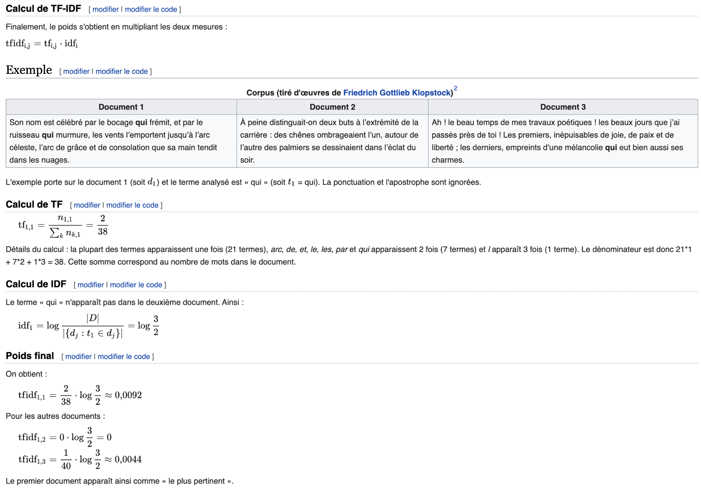

# Word weightings

Words are weighted by the computation of TF * IDF.

This calculus is often used for basic k-means clustering. Maybe it will improve the clustering in addition to Bert.

## TF * IDF

TF (Term Frequency) : Raw count of a term in a document.

IDF (Inverse document frequency) : Logarithm of inverse number of document which contains the term over the corpus.

### Example:

